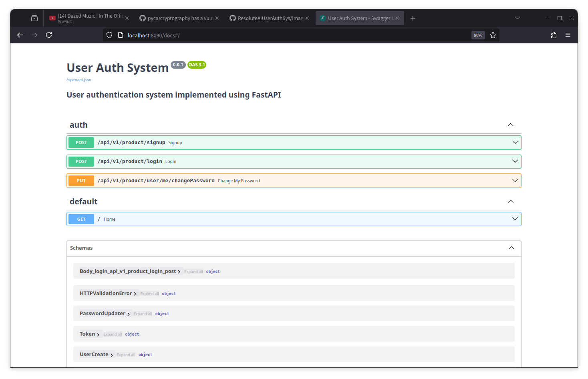

# User Authentication System 🚀

This is a small user authentication system project built using Python tech stack & MongoDB database.

---

> [!IMPORTANT]
> Read note and uncomment modules and libraries from requirements.txt file.<br>
> Please create a MongoDB database called **UsersDB** and inside it create a collection called **users**. [click here](https://account.mongodb.com/account/login).

## Project setup

- Download the project by cloning this project.

```bash
git clone https://github.com/Now-Tiger/ResoluteAIUserAuthSys.git
```

- First create a python virtual environment.
- Install the Python modules by running `pip install requirements.txt`
- <mark>Read and rename .example_env file with .env </mark>

- If you have conda installed then run below command that will create a new environment and install all the modules/libraries.

```bash
conda create --name <env_name> --file requirements.txt
```

## URL Endpoints

<mark>You can hit all the endpoints from FastAPI's swagger page(one place), which can be accessed via below URL</mark>

```bash
http://127.0.0.1:8080/docs
```

You'll have something like this:


#### User Sign up 📌

```bash
# URL: http://127.0.0.1:8080/api/v1/product/signup

# Or you copy past below command on your terminal

curl -d "first_name=John" -d "last_name=Doe" -d "username=johndoe88" -d "password=johnspassowrd" -d "email=john@gmail.com" -X 'POST' http://127.0.0.1:8080/api/v1/product/signup
```

#### Log in 📌

```bash
# URL: http://127.0.0.1:8080/api/v1/product/login

curl -d "username=johndoe88" -d "password=johnspassowrd" -X 'POST' http://127.0.0.1:8080/api/v1/product/login
```

#### User authorized actions 📌

These actions are user specific actions.<br>

**Change password**


```bash
curl -d "old_passowrd=johnspassword" -d "new_password=johns_new_password" -X 'PUT' http://127.0.0.1:8080/api/v1/product/user/me/changePassword
```

## Tech stack 🦖

- FastAPI
- Pydantic
- MongoDB
- JWT

## Goals


